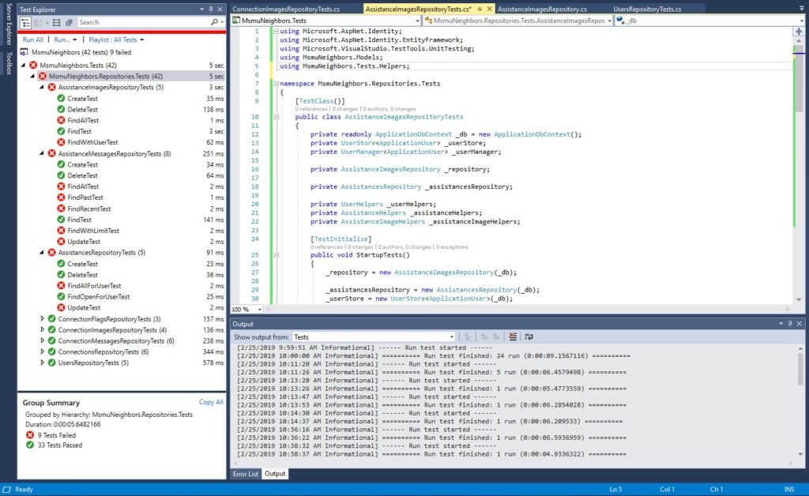

<figure>
<figcaption>Unit testing is fun.</figcaption></figure>

When I started building out my unit tests, I did not want to mock my database for unit tests. The models were heavily connected and I wanted to make sure model integrity was being met. Creating a new datastore with SQLEXPRESS seemed like a better idea for this project.

Do to this, I needed access to the UserManager, so users could be created when needed.

