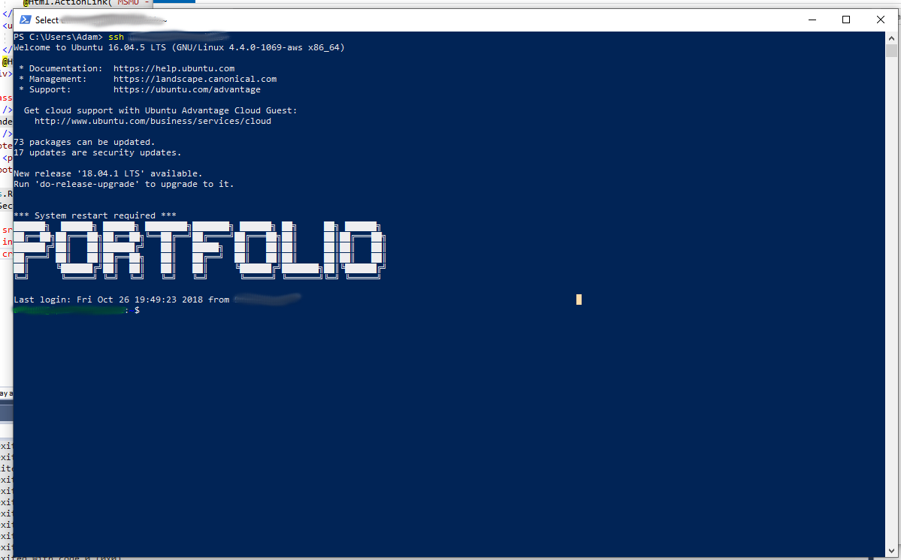

I&#8217;m not sure when it happened but Powershell has ssh builtin. You can literally run the same command that you would run on linux and macOS and you will be greeted with a session.

It will even read your .ssh folder in your home directory, handling your config file and any associated keys.

It makes me happy that I can just use ssh on windows now without having to use putty. I don&#8217;t know why it took so long.
